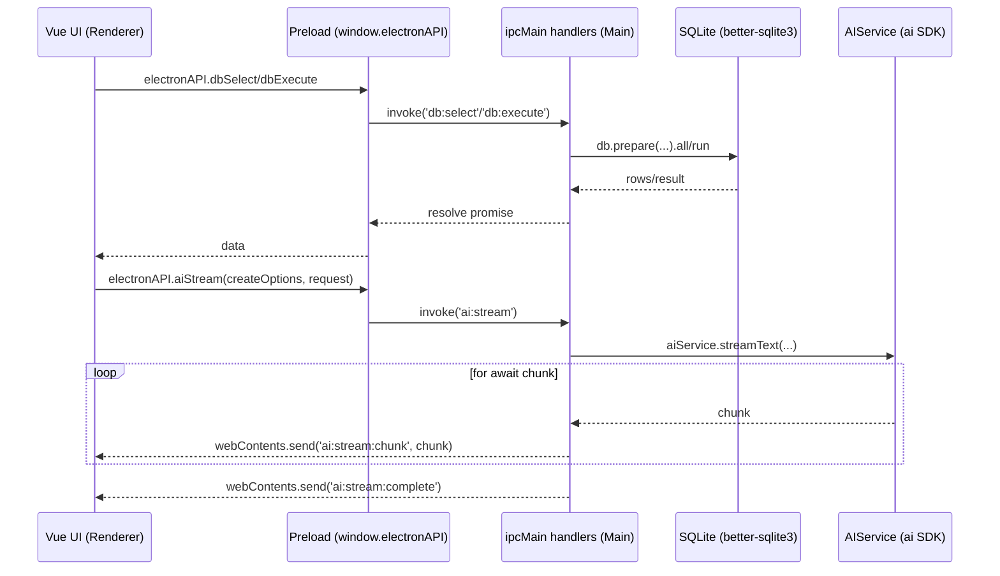

# 02-架构与运行时

## 分层与进程模型

Tibis 在运行时由两部分组成：

- 渲染进程（Renderer）：Vite 打包的 Vue 应用，负责 UI 与交互逻辑
- 主进程（Main）：Electron 主进程，负责窗口、文件系统、SQLite、加密存储、AI 调用等系统能力

两者通过 IPC 通信，渲染进程只能通过 preload 暴露的 `window.electronAPI` 访问系统能力。

## 启动链路

### 渲染进程

- 入口：`src/main.ts`
- 根组件：`src/App.vue`
- 路由：`src/router/index.ts` + `src/router/routes/*`

### 主进程

- 入口：`electron/main/index.mts`
- 初始化顺序（核心逻辑在 `bootstrap()`）：
  1. `initLogger()`
  2. `initStore()` + `migrateFromTauri()`
  3. `initDatabase()`
  4. `registerAllIpcHandlers()`
  5. `createWindow()`

## IPC 与桥接（Bridge）

### Preload 暴露面

- `electron/preload/index.mts` 使用 `contextBridge.exposeInMainWorld('electronAPI', electronAPI)`
- 暴露能力分组：
  - dialog：打开/保存文件
  - fs：写文件
  - window：标题、最小化/最大化/关闭、状态查询
  - db：`dbSelect/dbExecute`
  - store：`storeGet/storeSet/storeDelete`
  - shell：`openExternal`
  - ai：`aiInvoke/aiStream` + stream events
  - logger：debug/info/warn/error（send 通道）

### 渲染进程访问方式

- `src/shared/platform/electron-api.ts` 提供 `hasElectronAPI()` 与 `getElectronAPI()`，业务代码通过 helper 访问，避免直接读写 `window.electronAPI`

## 运行时数据流（概览）

## 配置与构建边界

### Vite 构建

- `vite.config.ts`：
  - alias `@ -> ./src`
  - dev server port `1420`
  - `unplugin-vue-components` + Ant Design Vue resolver（自动按需注册组件）

### Electron 构建

- TypeScript：`electron/tsconfig.json` 编译到 `dist-electron/`
- 运行入口（package.json main）：`dist-electron/main/index.mjs`
- 打包：`electron-builder.yml`

## 错误与日志

- 主进程：`electron-log` 统一记录（同时提供 IPC logger 通道给渲染进程）
- AI：主进程 `AIProviderRegistry.normalizeError()` 将第三方 SDK 错误归一化后返回渲染进程（流式通过 `ai:stream:error` 事件传递）
