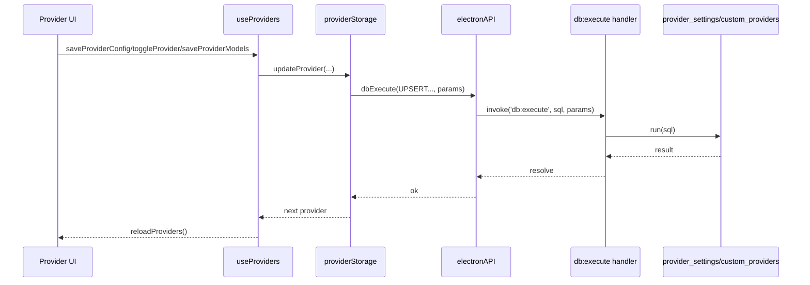
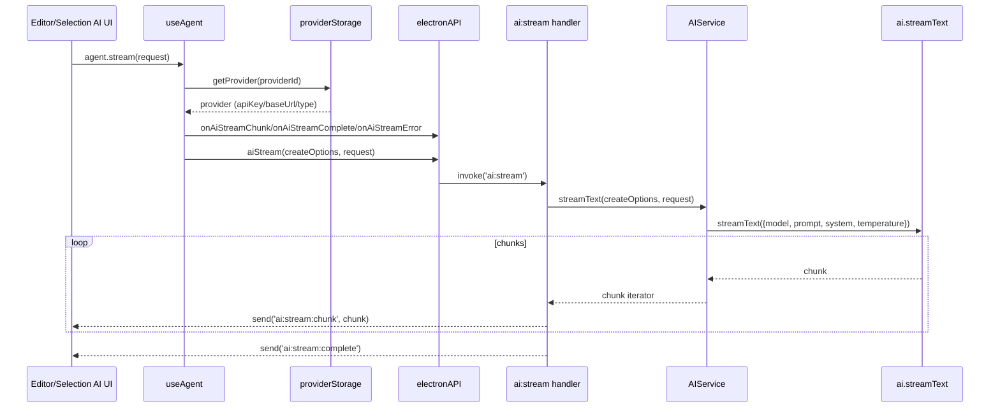
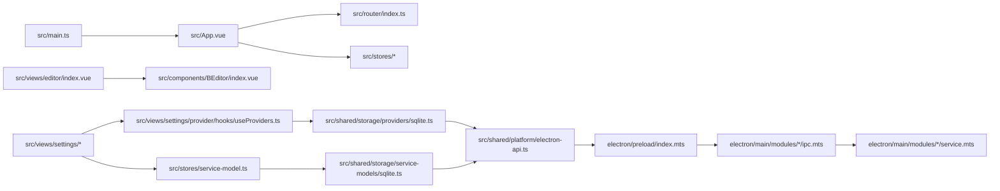

# 09-依赖与调用关系图

## 分层依赖（概览）

```mermaid
flowchart TB
  subgraph Renderer[Renderer (Vue)]
    UI[src/views + src/components]
    Stores[src/stores]
    Shared[src/shared]
    Hooks[src/hooks]
  end

  subgraph Bridge[Preload]
    API[window.electronAPI]
  end

  subgraph Main[Electron Main]
    IPC[ipc handlers]
    Svc[services]
    DB[(SQLite)]
    Store[(electron-store)]
  end

  UI --> Hooks
  UI --> Stores
  UI --> Shared
  Hooks --> Shared
  Shared --> API
  API --> IPC
  IPC --> Svc
  Svc --> DB
  Svc --> Store
```

## 关键调用链：Provider 设置保存



## 关键调用链：AI 流式生成



## 关键“收口点”依赖图


