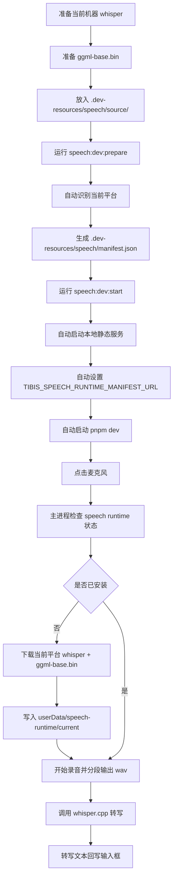

# Speech 模块总览

## 目的

这个目录用于集中说明项目里的语音能力主要怎么做，方便后续继续实现、联调和发布。

当前语音方案的目标是：

- 聊天输入支持点击麦克风录音
- 前端直接录制并分段产出 `wav`
- 主进程使用 `whisper.cpp` 做本地转写
- 用户首次使用时，应用按需下载语音运行时
- 设置页提供语音组件的查看、安装、重装和删除入口

## 当前总体方案

### 1. 前端录音

前端录音逻辑位于：

- `src/components/BChatSidebar/hooks/useVoiceRecorder.ts`

当前做法：

- 使用浏览器音频采集能力获取 PCM
- 直接在前端编码为分段 `wav`
- 默认参数为：
  - `16000 Hz`
  - `mono`
  - `16-bit PCM`
- 录音按短分段处理，默认每 `3-5` 秒切一段

这样做的原因：

- 不再依赖 `webm -> ffmpeg -> wav`
- 避开 `ffmpeg` 分发和许可证复杂度
- 控制单段大小，减少内存和 IPC 压力

## 2. 聊天语音入口

聊天工具栏和语音入口位于：

- `src/components/BChatSidebar/components/InputToolbar.vue`
- `src/components/BChatSidebar/components/InputToolbar/VoiceInput.vue`
- `src/components/BChatSidebar/hooks/useVoiceSession.ts`
- `src/components/BChatSidebar/index.vue`

当前链路：

1. 用户点击麦克风
2. `VoiceInput.vue` 先检查本地语音运行时是否已安装
3. 未安装时触发按需下载
4. 安装完成后开始录音
5. 分段 `wav` 通过 `useVoiceSession.ts` 调用 Electron API 转写
6. 转写完成后把最终文本写回聊天输入框

## 3. 主进程转写

主进程语音模块位于：

- `electron/main/modules/speech/types.mts`
- `electron/main/modules/speech/runtime.mts`
- `electron/main/modules/speech/installer.mts`
- `electron/main/modules/speech/service.mts`
- `electron/main/modules/speech/ipc.mts`

职责分层：

- `types.mts`
  - 语音请求、结果、运行时状态、安装进度、资源清单类型
- `runtime.mts`
  - 运行时目录、manifest、状态检查、已安装路径解析、删除
- `installer.mts`
  - 下载、校验、安装、原子替换
- `service.mts`
  - 单段音频转写
- `ipc.mts`
  - 对渲染进程暴露 runtime 和 transcribe 相关接口

## 4. 按需下载运行时

正式产品路径不要求用户手动配置：

- `TIBIS_WHISPER_CPP_PATH`
- `TIBIS_WHISPER_MODEL_PATH`

而是改成：

1. 用户第一次使用语音功能
2. 应用检查 `userData/speech-runtime`
3. 若未安装，则自动下载运行时
4. 下载完成后写入本地应用数据目录
5. 后续直接复用

运行时安装目录：

- `app.getPath('userData')/speech-runtime`

建议结构：

```text
speech-runtime/
  manifest.json
  current/
    bin/
      whisper
      whisper.exe
    models/
      ggml-base.bin
```

## 5. 正式下载源方案

正式下载源推荐使用：

- `manifest URL + 静态资源托管`

代码入口在：

- `electron/main/modules/speech/installer.mts`

当前支持两种模式：

### 推荐模式：Manifest URL

环境变量：

- `TIBIS_SPEECH_RUNTIME_MANIFEST_URL`

含义：

- 应用先下载远程 `manifest.json`
- 再根据 `platform + arch` 选择对应 `whisper` 和模型资源

这是正式推荐方案，因为它更适合：

- 多平台分发
- 版本切换
- 校验控制
- 后续回滚或升级

### 兜底模式：Base URL

环境变量：

- `TIBIS_SPEECH_RUNTIME_BASE_URL`

这个模式仍然保留，但更适合开发或临时联调，不建议作为长期正式发布方式。

## 6. 推荐资源目录

推荐的下载资源目录：

```text
/speech-runtime/
  manifest.json
  2026.05.04/
    darwin-arm64/
      whisper
    darwin-x64/
      whisper
    win32-x64/
      whisper.exe
    models/
      ggml-base.bin
```

仓库内建议同时保留一份程序读取用的 manifest 模板：

- `resources/speech/manifest.json`

这样可以把“给人看的说明文档”和“给程序读的资源清单”分开维护。

推荐 `manifest.json` 中按平台组织：

- `darwin-arm64`
- `darwin-x64`
- `win32-x64`

每个平台至少包含：

- `version`
- `modelName`
- `whisper.url`
- `whisper.sha256`
- `model.url`
- `model.sha256`

发布资源时可以直接使用下面四条命令：

- `pnpm run speech:manifest:fill -- --manifest <manifest> --darwin-arm64 <file> --darwin-x64 <file> --win32-x64 <file> --model <file>`
- `pnpm run speech:manifest:hash -- <file...>`
- `pnpm run speech:manifest:localize -- --manifest <manifest> --base-url http://127.0.0.1:8787`
- `pnpm run speech:manifest:validate`

其中：

- `speech:manifest:fill` 用于批量计算四个发布文件的 `sha256` 并直接回填 manifest
- `speech:manifest:hash` 用于为本地资源文件生成 `sha256`
- `speech:manifest:localize` 用于把 manifest 中的资源地址切换到本地静态服务，便于开发联调自动安装链路
- `speech:manifest:validate` 用于校验 `resources/speech/manifest.json` 的结构是否完整

推荐的 GitHub Release 约定：

- release tag：`speech-runtime-2026.05.04`
- 资源文件名：
  - `whisper-darwin-arm64`
  - `whisper-darwin-x64`
  - `whisper-win32-x64.exe`
- 模型文件继续使用官方推荐地址：
  - `https://huggingface.co/ggerganov/whisper.cpp/resolve/main/ggml-base.bin`

发布时的回填清单：

1. 上传三个 `whisper` 可执行文件到 `xbinator/tibis` 对应 release
2. 运行 `pnpm run speech:manifest:fill -- --manifest resources/speech/manifest.json --darwin-arm64 <file> --darwin-x64 <file> --win32-x64 <file> --model <file>`
3. 如需单独核对某个文件，可额外运行 `pnpm run speech:manifest:hash -- <file>`
4. 运行 `pnpm run speech:manifest:validate`
5. 将最终 manifest 发布到 `TIBIS_SPEECH_RUNTIME_MANIFEST_URL` 指向的位置

本地开发联调自动安装时，建议默认使用仓库内的 `.dev-resources/speech/` 目录，并固定两份源文件：

- `.dev-resources/speech/source/whisper-cli`
- `.dev-resources/speech/source/ggml-base.bin`

这里统一的是本地开发源文件名。

- 本地静态资源目录里统一使用 `whisper-cli`
- 实际安装到应用运行时目录后，仍会按平台落成 `bin/whisper` 或 `bin/whisper.exe`

注意：

- 如果从 `whisper.cpp` 编译得到的是 `build/bin/whisper-cli`，本地联调时直接复制到 `.dev-resources/speech/source/whisper-cli`
- `ggml-base.bin` 保持原文件名即可

示例：

```bash
mkdir -p .dev-resources/speech/source
cp /path/to/whisper.cpp/build/bin/whisper-cli .dev-resources/speech/source/whisper-cli
cp /path/to/whisper.cpp/models/ggml-base.bin .dev-resources/speech/source/ggml-base.bin
```

流程可以收敛成：

1. 运行 `pnpm run speech:dev:prepare`
2. 运行 `pnpm run speech:dev:start`

其中 `speech:dev:prepare` 会自动完成：

- 复制 manifest 模板到 `.dev-resources/speech/manifest.json`
- 自动判断当前机器平台
- 仅保留当前平台所需的 manifest 项
- 将资源地址切换为本地 `127.0.0.1` 静态服务
- 回填当前 `whisper` 和 `ggml-base.bin` 的 `sha256`

其中 `speech:dev:start` 会自动完成：

- 启动 `.dev-resources/speech/` 的本地静态服务
- 设置 `TIBIS_SPEECH_RUNTIME_MANIFEST_URL=http://127.0.0.1:8787/manifest.json`
- 启动 Electron 开发环境

开发流程图：



如果只想抓住核心，可以简单理解为：

1. 把两个源文件放进 `.dev-resources/speech/source/`
2. `speech:dev:prepare` 负责把“本地资源目录”准备好
3. `speech:dev:start` 负责起服务并启动开发环境
4. 应用启动后通过 `TIBIS_SPEECH_RUNTIME_MANIFEST_URL` 去下载当前平台所需资源

## 7. 设置页入口

设置页语音组件入口位于：

- `src/views/settings/speech/index.vue`

当前职责：

- 展示当前安装状态
- 展示平台、架构、模型、版本、安装目录
- 支持下载
- 支持重装
- 支持删除

相关菜单和路由位于：

- `src/views/settings/constants.ts`
- `src/router/routes/modules/settings.ts`

## 8. 当前验证重点

当前已经补的精确测试主要覆盖：

- 主进程 runtime 状态解析
- 安装器安装流程
- `speech` 服务基础转写行为
- `wav` 编码头部正确性
- 聊天语音入口接线
- 设置页语音组件入口接线

对应测试文件：

- `test/electron/runtime-manager.test.ts`
- `test/electron/speech-installer.test.ts`
- `test/electron/speech-service.test.ts`
- `test/components/BChatSidebar/useVoiceRecorder.wav.test.ts`
- `test/components/BChat/voice-input-flow.test.ts`
- `test/views/settings/speech/index.test.ts`

## 9. 后续建议

后续优先建议继续做这几件事：

1. 根据 `resources/speech/manifest.json` 准备正式 `manifest.json` 和下载资源
2. 产出并上传 `whisper-darwin-arm64`、`whisper-darwin-x64`、`whisper-win32-x64.exe`
3. 用 `speech:manifest:hash` 为发布资源生成真实 `sha256`
4. 真机验证：
  - `macOS arm64`
  - `macOS x64`
  - `Windows x64`
5. 补一次“从点击麦克风到自动安装再到转写成功”的完整联调

## 参考文档

更详细的设计和实施文档可参考：

- `docs/superpowers/specs/2026-05-02-chat-voice-input-design.md`
- `docs/superpowers/specs/2026-05-04-speech-runtime-on-demand-design.md`
- `resources/speech/manifest.json`
- `docs/superpowers/plans/2026-05-04-speech-runtime-on-demand.md`
