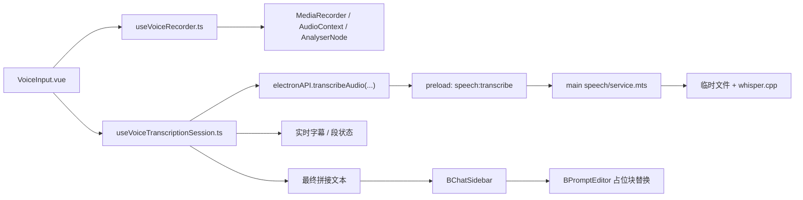

# Chat 语音输入方案

## 背景

`BChatSidebar` 当前仅支持文本、图片和 slash command 输入，不支持本地语音录制与识别。目标是在 [src/components/BChatSidebar/components/InputToolbar.vue](/src/components/BChatSidebar/components/InputToolbar.vue) 中引入一个独立语音输入组件，支持：

- 录音波形
- 边录边转写
- 自动切片与手动分段混合模式
- 多段结果拼接
- 最终文本插入 `BPromptEditor` 当前光标位置

语音识别后端采用 `whisper.cpp`，录音发生在渲染进程，转写发生在 Electron 主进程。

## 目标

- 新增一个独立的 `VoiceInput` 组件，避免把录音、转写、波形逻辑堆进 `InputToolbar.vue`
- 在录音过程中提供实时波形与临时字幕反馈
- 通过“输入框占位块替换”机制，避免频繁改写 `CodeMirror` 正文导致光标抖动和撤销栈污染
- 通过主进程 `speech` IPC 模块调用 `whisper.cpp`，保证本地可执行文件与模型访问边界清晰
- 允许单段失败后重试，不因为某一段失败直接废弃整次录音

## 非目标

- 第一版不实现静音检测切段，先使用固定时长自动切片
- 第一版不实现服务模型设置页中的语音参数配置界面
- 第一版不实现语音自动发送消息
- 第一版不把语音中间结果直接持续写入 `BPromptEditor` 正文

## 总体方案

采用“三层结构”：

1. `VoiceInput.vue`
   负责按钮、录音状态、波形、临时字幕面板、手动分段入口。
2. `useVoiceTranscriptionSession.ts`
   负责录音会话、自动切片、手动分段、转写队列、段状态、拼接结果。
3. Electron 主进程 `speech` 模块
   负责接收单段音频、落盘、调用 `whisper.cpp`、返回文本结果。

`BChatSidebar` 负责创建和替换输入框中的语音占位块，并在会话完成后将最终文本插入当前光标位置。

## 架构



## 前端组件设计

### `VoiceInput.vue`

新增独立组件 `src/components/BChatSidebar/components/VoiceInput.vue`，由 `InputToolbar.vue` 引入。组件职责：

- 开始录音、停止录音、取消录音
- 展示当前会话状态
- 展示实时波形
- 展示临时字幕与段落状态
- 触发“手动分段”
- 会话完成后向父层派发最终文本

建议对外事件：

- `complete`：返回最终拼接文本与会话元信息
- `cancel`：用户取消录音
- `error`：会话级错误

建议 props：

- `disabled`
- `insertMode`，固定为当前需求下的 `cursor`

### `VoiceWaveform.vue`

新增子组件 `src/components/BChatSidebar/components/VoiceWaveform.vue`，仅负责渲染波形。数据来自 `useVoiceRecorder.ts` 提供的采样数组，不关心转写状态。

第一版采用 `canvas` 绘制单声道波形：

- `recording` 时实时刷新
- `stopping` / `finalizing` 时停止刷新并保留最后状态
- `idle` / `cancelled` / `completed` 时恢复初始态

### `InputToolbar.vue`

`InputToolbar.vue` 不承载具体录音逻辑，只负责：

- 在现有图片上传、模型选择、发送按钮旁挂载 `VoiceInput`
- 在 `loading` 等已有条件下协调禁用状态

## 前端会话模型

新增 hook：`src/components/BChatSidebar/hooks/useVoiceTranscriptionSession.ts`

### 会话状态

```ts
type VoiceSessionStatus =
  | 'idle'
  | 'recording'
  | 'stopping'
  | 'finalizing'
  | 'completed'
  | 'error'
  | 'cancelled';
```

### 段状态

```ts
type VoiceSegmentStatus =
  | 'pending'
  | 'transcribing'
  | 'partial'
  | 'final'
  | 'failed';
```

### 段结构

```ts
interface VoiceSegment {
  id: string;
  index: number;
  startedAt: number;
  endedAt: number | null;
  status: VoiceSegmentStatus;
  text: string;
  separator: '' | '\n';
  errorMessage?: string;
}
```

### 切片策略

采用“混合模式”：

- 自动切片：默认每 `3~5` 秒产生一个技术切片
- 手动分段：用户点击“新段落”时立即结束当前段并开始新段
- 停止录音：强制 flush 当前未完成段

区分两类边界：

- 技术切片：仅为了边录边转写与性能控制
- 逻辑段落：用于最终文本拼接，手动分段边界插入换行

自动切片默认不插入换行，手动分段边界对应的下一个段使用 `separator: '\n'`。

### 实时字幕

录音过程中，实时字幕只展示在 `VoiceInput.vue` 内部面板，不直接写入编辑器正文。面板内容由当前所有已返回文本的段按顺序拼接生成。

如果当前段仍在转写中，可在面板中显示“识别中”状态，但不把未稳定结果写进输入框。

### 转写队列

转写任务采用串行队列：

- 新切片进入队列后按顺序执行
- 同一时刻只运行一个 `whisper.cpp` 子进程
- 失败段保留在列表中，允许停止录音后单独重试

串行的原因：

- 本地模型调用 CPU 占用高
- 并发多段会让顺序控制、资源占用和错误恢复更复杂

## 录音与波形

新增 hook：`src/components/BChatSidebar/hooks/useVoiceRecorder.ts`

职责：

- 封装 `navigator.mediaDevices.getUserMedia`
- 使用 `MediaRecorder` 生成音频片段
- 使用 `AudioContext + AnalyserNode` 生成波形采样
- 对外暴露：
  - `start`
  - `stop`
  - `cancel`
  - `flushSegment`
  - `waveformSamples`
  - `permissionState`

第一版录音格式优先选择浏览器稳定可用的 `audio/webm`。

## 输入框集成策略

### 占位块替换

开始录音时，由 `BChatSidebar` 在 `BPromptEditor` 当前光标位置插入一个稳定的语音占位块。录音过程中：

- 占位块在输入框内保持稳定，不随每个中间段结果频繁变化
- `VoiceInput` 组件自己维护实时字幕预览

当所有段完成拼接后：

- 用最终文本一次性替换占位块
- 光标落在插入文本末尾，保持后续输入连贯

当用户取消录音时：

- 直接移除占位块

### 编辑器扩展需求

`BPromptEditor` 需要补充一组最小能力，供语音输入使用：

- 插入语音占位块
- 通过占位块 ID 替换为最终文本
- 通过占位块 ID 删除

如果当前已有 variable chip / slash command 扩展可以复用占位 widget 机制，则优先复用；否则新增一个轻量占位标记扩展。

## Electron API 设计

### 渲染侧类型

扩展 [types/electron-api.d.ts](/types/electron-api.d.ts)：

```ts
interface ElectronAudioTranscribeRequest {
  buffer: ArrayBuffer;
  mimeType: string;
  segmentId: string;
  language?: string;
  prompt?: string;
}

interface ElectronAudioTranscribeResult {
  segmentId: string;
  text: string;
  language?: string;
  durationMs: number;
}
```

`ElectronAPI` 新增：

```ts
transcribeAudio: (request: ElectronAudioTranscribeRequest) => Promise<ElectronAudioTranscribeResult>;
```

### preload

在 [electron/preload/index.mts](/electron/preload/index.mts) 新增：

```ts
transcribeAudio: (request) => ipcRenderer.invoke('speech:transcribe', request)
```

## 主进程 speech 模块

新增目录：

- `electron/main/modules/speech/ipc.mts`
- `electron/main/modules/speech/service.mts`
- `electron/main/modules/speech/types.mts`

并在 [electron/main/modules/index.mts](/electron/main/modules/index.mts) 注册 `registerSpeechHandlers()`。

### 职责边界

主进程只处理单段请求，不维护前端录音会话：

- 接收单段音频
- 写入临时目录
- 必要时做格式转换
- 调用 `whisper.cpp`
- 读取文本结果
- 清理临时文件

### 单段转写流程

1. 接收 `speech:transcribe` 请求
2. 在临时目录创建当前段工作目录
3. 写入 `input.webm`
4. 转码得到 `input.wav`
5. 调用 `whisper.cpp`
6. 读取 `output.txt`
7. 删除临时目录
8. 返回 `segmentId + text + durationMs`

### 文件格式策略

第一版统一流程为：

- 前端录制 `webm`
- 主进程转成 `wav`
- `whisper.cpp` 读取 `wav`

这样可以把浏览器录音兼容性问题和 `whisper.cpp` 输入格式要求集中在主进程处理。

### whisper.cpp 配置

第一版先在 `speech/service.mts` 中集中管理以下配置：

- 可执行文件路径
- 模型文件路径
- 默认语言
- 线程数
- 超时时间

后续若需要设置页，再迁移到存储层。

## 错误处理

### 会话级错误

以下错误进入 `error` 状态并中止当前会话：

- 麦克风权限被拒绝
- `MediaRecorder` 不可用
- `whisper.cpp` 二进制不存在
- 模型文件不存在
- 无法初始化录音设备

### 段级错误

以下错误只影响当前段，不直接废弃整个会话：

- 单段转码失败
- `whisper.cpp` 子进程非零退出
- 单段超时
- 单段输出为空且可重试

失败段保留在段列表中，并允许用户在停止录音后点击重试。最终拼接时默认忽略失败段，但在组件中显示失败数量与重试入口。

## 日志

复用现有 `logger` 体系，在主进程记录：

- 段开始转写
- 段完成与耗时
- `stderr` 摘要
- 转码失败原因
- 二进制或模型缺失

渲染层记录：

- 麦克风权限拒绝
- 录音初始化失败
- 会话取消

## 测试策略

### 前端

- `useVoiceRecorder` 单测：
  - 录音开始/停止/取消状态切换
  - `flushSegment` 行为
- `useVoiceTranscriptionSession` 单测：
  - 自动切片队列
  - 手动分段换行拼接
  - 段失败后重试
- `VoiceInput.vue` 组件测试：
  - 不同状态下按钮和字幕面板展示
  - 完成后正确发出 `complete`

### 主进程

- `speech/service.mts` 单测：
  - 命令参数拼装
  - 缺失二进制/模型时报错
  - 成功读取文本结果

## 实施顺序

1. 扩展 `types/electron-api.d.ts` 与 `electron/preload/index.mts`
2. 新增主进程 `speech` 模块，先用 mock 文本打通 IPC
3. 实现 `useVoiceRecorder.ts` 与 `VoiceWaveform.vue`
4. 实现 `useVoiceTranscriptionSession.ts`
5. 在 `InputToolbar.vue` 中接入 `VoiceInput.vue`
6. 为 `BPromptEditor` 增加占位块插入、替换、删除能力
7. 接入真实 `whisper.cpp` 与临时文件清理
8. 补测试与 changelog

## 风险与取舍

- 实时字幕不直接写编辑器，牺牲了一点“正文实时可见性”，换来更稳定的光标与撤销体验
- 第一版不做静音检测，切片边界可能不如理想，但实现风险更低
- 主进程串行转写吞吐更低，但对桌面本地模型场景更稳
- 如果 `webm -> wav` 转码依赖额外二进制，后续需要明确随应用一起分发的策略

## 决策结论

- 采用独立 `VoiceInput` 组件，而不是把语音逻辑写进 `InputToolbar.vue`
- 采用“录音波形 + 实时字幕面板 + 输入框占位块替换”交互
- 采用固定时长自动切片 + 手动分段混合模式
- 采用前端维护会话、主进程处理单段 `whisper.cpp` 转写的架构
- 最终文本统一插入 `BPromptEditor` 当前光标位置
